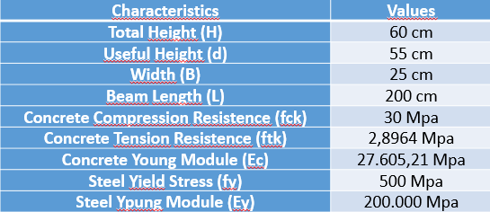

# AlfaMCV Version 1.0

## Abstract

This is a software to calculate the behavior of any reinforced concrete beam which is subjected to a pontual load in the middpoint of this beam. Based on the physical-geometric characteristics of the structure, AlfaMCV is able to calculate some behavior of the structure, considering linear and non-linear concrete in this stress-strain graph. Thus, this case presents the real behavior of the structure.
AlfaMCV is able to present some pieces of information about the structure, such as: neutral axis for the analysis of each stage, stresses and strain in steel and concrete (in both cases, compression and tension), moment in the midpoint of the beam and its deflection.
Finally, the user can export the table to Excel software and create their own analyzes and graphs.

## Introduction

Concrete is a weak material whose structure is calculated without the tensile behavior in concrete, i.e., only compression in concrete is considered. For the case of steel, both cases are considered compression and tension. In this region, Figure 1 shows the areas of all stresses on concrete and steel.

 <b>Figure 1:</b> Stress - Strain Concrete Configuration (Reis et al, 2017). 

Where Ast is steel area in tension, Fst is steel's force in tension, <i>&epsilon;</i>cm is compression's strain in concrete, Fcm is compression's force in concrete, kd is neutral axis and Mk is characteristics moment.

It is already well known about the compressive behavior of concrete, according to BAZANT (1984) and PFEIL (1969) presented in the literature. In addition, this type of behavior (the parabolic rectangular diagram) has been used by NBR 6118:2014, as shown in Figure 2.

 <b>Figure 2:</b> Stress - Strain Concrete Configuration in ABNT NBR 6118:2014 

Where fck is the characteristic concrete compression resistence, fcd is the calculated concrete compression resistence, <i>&epsilon;</i>c2 is strain when concrete starts the plastic deformation and <i>&epsilon;</i>cu is strain when concrete ruptures.

However, the tension behavior in concrete is not used in design structures and the studies by BAZANT (1984) showed that this area can contribute to the evolution of the general stiffness of the structure, as in Figure 3.

 <b>Figure 3:</b> Stress - Strain Concrete Configuration in Tension (Reis et al, 2017)

Where ftk is characteristic concrete tension resistence, <i>&epsilon;</i>tp is concrete strain in maximun concrete tension resistence, Ec is Moduli's Young, <i>&epsilon;</i>tf is concrete strain when tension stress is zero and Et is tangent Moduli.

## Methodology

All methodology can see in REIS et al (2017) and BAZANT (1984).

## About the Software

AlfaMCV (Moment Curvature in Reinforced Concrete Beams or Momento Curvatura em Vigass de Concreto Armado, in Portuguese), is a simple software which can interact the user, i.e., it is a GUI interface. The software was developed with the Visual Basic computational programing and the Microsoft Visual Studio 2017 platform was used. The software is in Portuguese.
AlfaMCV presents a main window which four buttons are presented: "Calcular" (Calculation), "Sobre o Software" (About the Software), "Ajuda" (Help0 and "Sair" (Exit), as shown in Figure 4.

 <b>Figure 4:</b> AlfaMCV - Principal Window (Reis et al, 2017)

The "Calcular" button opens a new window, where the user can inpput data about the physical-geometric characteristics of the structure. The user needs: "Altura Total - H (cm)" (total useful height H, cm), "Altura útil total - d (cm)" (total useful height d, cm), "Largura - B (cm)" (width B, cm), "Vão (cm)" (beam length, cm), "Resistência à Compressão do Concreto - fck (MPa)" (concrete compressive strength - fck sub> MPa), "Resistência à Tração do Concreto - ftk (MPa)" (tensile strength of concrete fck MPa), "Módulo de Elasticidade do Concreto (MPa)" (Concrete's Young Modulus MPa), "Área de Aço de  Compressão - A's (cm²)" (Steel Compression Area A's< /sub>, cm²), "Área de aço de Tração - As (cm²)" (strength area of steel As, cm²), "Steel Elasticity Modulus - Es (MPa)" (Young Modulus MPa steel) and "Escoamento Aço - f< sub>y (MPa)" (fy MPa yield steel). All these features can be seen in Figure 5.

 <b>Figure 5:</b> AlfaMCV - Calculus Window (Reis et al, 2017)

After intput the data, a new window opens with all the pieces of information about the structure. The first tab "Regime Linear" (Linear Behavior) presents some information about the structure, such as "Altura da linha neutra (cm)" (Height of the neutral axis, cm), "Deformação máxima de tração do concreto" (maximum strain of concrete in tensile behavior), "Deformação do concreto na compressão quando a tensão máxima é obtido" (Concrete strain in compression when maximum stress is obtained), "Deformação máxima de compressão do concreto" (maximum compressive strain of concrete), "Deformação de tração do aço" (Tensile strain of steel), "Deformação de compressão do aço" (Compressive strain of steel), "Momento de fissuração (kN.m)" (Cracking moment (kN. m)). All these features is shown Figure 6.

 <b>Figure 6:</b> AlfaMCV - Result Window - Linear Behavior (Reis et al, 2017)

The "Regime Não Linear" (Nonlinear Behavior) tab presents the behavior of a structure for each step of the analysis. Thus, in this case, there are 8 columns with information about the structure: "Índice i" (index i), "Tipo de Regime" (type of behavior), "Linha Neutra (cm)" (neutral axis, cm), "Deformação Compressão Concreto" (concrete compression strain), "Deformação Compressão do Aço" (steel compression strain), "Deformação Tração do Aço" (steel tension strain), "Momento (kN.m)" (Moment kN.m) and "Deflexão (cm)" (deflexion, cm). This table is shown in Figure 7.

 <b>Figure 7:</b> AlfaMCV - Result Window - Nonlinear Behavior (Reis et al, 2017)

After that, the user can export this table to the Excel software, just press the button "Exportar para Excel" (export to excel) on the menu and rename the file and save it anywhere on the computer. The second button on the menu, "Ajuda" (Help), opens a window with some instructions on how the user can use the software, input data and output data, as shown in Figure 8.

 

 <b>Figure 8:</b> AlfaMCV - Help Window - Nonlinear Behavior (Reis et al, 2017)

Finally, the third button is about the software, i.e., some pieces of information about the developer, professors and the University. Figure 9 shows this description.

 <b>Figure 9:</b> AlfaMCV - About Window - Nonlinear Behavior (Reis et al, 2017)

The AlfaMCV software has a Brazilian Registration at the INPI (National Institute of Industrial Property) and the registration number is BR 51 2016 001434-2.

## Results

Some analysis was realized with differents considerations of steel area in concrete section. Next, a table with physics-geometric characteristics:

 <b>Figure 10:</b> Structure Physics-Geometric Characteristics (Reis et al, 2017)

### Reinforced Concrete with low reinforcement

For this case, it was considered the crack moment in concrete, the moment considedred is equal to Mk = 31.7625 kN.m and a steel area with Asc = 1.2375 cm². The graphic was ploted, Figure 11, and all results have been compared: models of BAZANT (1984) and SAENZ (1964) considering the tension in concrete (red line), model of SAENZ (1964) without tension in concrete (blue line) and the moment of rupture (green line). It is possible to see that all cases converge to approximately the same moment value, Mk = 33.76 kN.m. The deflection shows by the software is 0.01171 cm and the calculated by literature is 0.0118 cm.

 <b>Figure 11:</b> Reinforced Concrete with low reinforcement (Reis et al, 2017)

### Reinforced Concrete with normal reinforcement

For this case was considered reinforcement rate equal to 0.178, the moment considedred is equal to Mk = 360.73 kN.m and a steel area with Asc = 14.685 cm². The graphic was ploted, Figure 12, and all results have been compared: models of BAZANT (1984) and SAENZ (1964) considering the tension in concrete (red line), model of SAENZ (1964) without tension in concrete (blue line) and the moment of rupture (green line). It is possible to see that all cases converge to approximately the same moment value, Mk = 366.48 kN.m. The deflection shows by the software (in linear behavior) is 0.01402 cm and calculated by literature is 0.012339 cm.

 <b>Figure 12:</b> Reinforced Concrete with normal reinforcement (Reis et al, 2017)

### Reinforced Concrete with hight reinforcement

For this case was considered reinforcement rate equal to 0.433, the moment considedred is equal to Mk = 723.73 kN.m and a steel area with Asc = 35.72 cm². The graphic was ploted, Figure 13, and all results have been compared: models of BAZANT (1984) and SAENZ (1964) considering the tension in concrete (red line), model of SAENZ (1964) without tension in concrete (blue line) and the moment of rupture (green line). The deflection shows by the software (in linear behavior) is 0.01328 cm and calculated by literature is 0.01734 cm.

 <b>Figure 13:</b> Reinforced Concrete with hight reinforcement (Reis et al, 2017)

### Reinforced Concrete with compression and tension reinforcement

For this case was considered Mk = 1000 kN.m and a steel area was calculated with Asc = 46.66 cm² and Ast = 16.74 cm². The graphic was ploted, Figure 14, and all results have been compared: models of BAZANT (1984) and SAENZ (1964) considering the tension in concrete (red line), model of SAENZ (1964) without tension in concrete (blue line) and the moment of rupture (green line). The deflection shows by the software (in linear behavior) is 0.02059 cm and calculated by literature is 0.0128 cm.

 <b>Figure 14:</b> Reinforced Concrete with compression and tension reinforcement (Reis et al, 2017)

## References

Reis, A.W.Q.R., Burgos, R.B, Magalhães, M.S. Development of a software for the numerical modeling of reinforced concrete sections. 3° EMI International Conference, 2017.

Reis, A.W.Q.R., Burgos, R.B, Magalhães, M.S. Desenvolvimento de um programa computacional para obtenção de gráficos momento vs curvatura e momento vs deflexão em vigas de concreto armado. 59° Congresso Brasileiro do Concreto, 2017.

Reis, A.W.Q.R., Burgos, R.B, Magalhães, M.S. Development of a software for the numerical modeling of reinforced concrete sections - AlfaMCV. SoftwareX - Elsevier, 2020.

Reis, A.W.Q.R. Modelagem Numerica de Seções de Concreto Armado. Rio de Janeiro State University. Graduation Thesis, 2017.

## Information About the Software

Rio de Janeiro State University

Faculty of Engineering

Developer: Ana Waldila de Queiroz Ramiro Reis

Professors: Margareth da Silva Magalhães and Rodrigo Bird Burgos

Contact: anawaldila@hotmail.com
