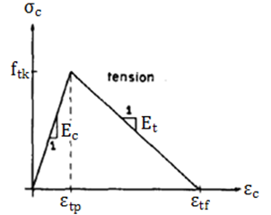

# AlfaMCV Version 1.0

## Abstract

This is a software to calculate the behavior of reinforced concrete beam when it is submited a pontual load in the middle of the beam. Based on phisics-geometric structure characteristics, AlfaMCV is able to calculate some informations about the structure, when it is considering linear and nonlinear concrete in this stress-strain graphic. So, this case presents the real structure behavior. 
AlfaMCV is able to presents some informations about the structure, like: neutral axis for each step analysis, stress and strain in steel and concrete (in both cases, compression and tension), moment in the middle of the beam and their deflection.
Finally, the user is able to export the table to Excel software and create their own analysis and graphics.

## Introduction

Concrete is a weak material where the structure is calculated without the behavior of tension in concrete, i.e, only compression in concrete is considered. For the case of steel, both cases are considered, compression and tension. This region, Figure 1 shows areas where can see all efforts about concrete and steel.

 <b>Figure 1:</b> Stress - Strain Concrete Configuration (Reis et al, 2017). 

Where Ast is steel area in tension, Fst is steel's force in tension, <i>&epsilon;</i>cm is compression's strain in concrete, Fcm is compression's force in concrete, kd is neutral axis and Mk is characteristics moment.

About the compression behavior of concrete, it has well been known, like BAZANT (1984) and PFEIL (1969) presented in literature. Moreover, this type of behavior (the parabolic rectangular dyagramn) has used by NBR 6118:2014, like presents Figure 2.

 <b>Figure 2:</b> Stress - Strain Concrete Configuration in ABNT NBR 6118:2014 

Where fck is the characteristic concrete compression resistence, fcd is the calculated concrete compression resistence, <i>&epsilon;</i>c2 is strain when concrete starts the plastic deformation and <i>&epsilon;</i>cu is strain when concrete ruptures.

However, the behavior of tension in concrete is not used in design structures and studies by BAZANT (1984) presented that this area can contribute to the evolution of general structure's stifness, like Figure 3.

 <b>Figure 3:</b> Stress - Strain Concrete Configuration in Tension (Reis et al, 2017)

Where ftk is characteristic concrete tension resistence, <i>&epsilon;</i>tp is concrete strain in maximun concrete tension resistence, Ec is Moduli's Young, <i>&epsilon;</i>tf is concrete strain when tension stress is zero and Et is tangent Moduli.

## Methodology

All methodology can see in REIS et al (2017) and BAZANT (1984).

## About the Software

AlfaMCV (Momento Curvature em Vigas de Concreto Armado, i.e, Curvature Moment in Reinforced Concrete Beams, in Portuguese), is a simple software where exists an interations between the programn and the user, i.e, exists a GUI interface. The software was developed with Visual Basic computational language and was used Microsoft Visual Studio 2017 platform. The software is in Portuguese.
The software shows a principal window where are presented four buttons: "Calcular" (Calculus), "Sobre o Software" (About the Software), "Ajuda" (Help) and "Sair" (Exit), like Figure 4.

 <b>Figure 4:</b> AlfaMCV - Principal Window (Reis et al, 2017)

The button "Calcular" (Calculus) open a new window, where the user can input data about the structure phisics-geometrics characteristics. There are necessaire: "Altura Total - H (cm)" (total height H, cm), "Altura Útil Total - d (cm)" (total useful height d, cm), "Largura - B (cm)" (width B, cm), "Vão (cm)" (beam length, cm), "Resistencia à Compressão do Concreto - fck (MPa)" (concrete compression resistence - fck MPa), "Resistencia à Tração do Concreto - ftk (MPa)" (concrete tension resistence fck MPa), "Modulo de Elasticidade do Concreto (MPa)" (concrete's Young Moduli MPa), "Área de Aço de Compressão - A's (cm²)" (steel compression area A's, cm²), "Área de Aço de Tração - As (cm²)" (steel tension area As, cm²), "Módulo de Elasticidade do Aço - Es (MPa)" (steel Young Moduli MPa) and "Escoamento do Aço - fy (MPa)" (yield steel fy MPa). All those characteristics can see in Figure 5.

 <b>Figure 5:</b> AlfaMCV - Calculus Window (Reis et al, 2017)

After input data, a new window is opened with all informations about the structure. The first tab "Regime Linear" (Linear Behavior), presents some informations about the structure, like "Altura da Linha Neutra (cm)" (neutral axis height, cm), "Deformação de Tração Máxima do Concreto" (maximum concrete tension strain), "Deformação de Compressão Correspondente à Tração Máxima" (concrete strain in compression when maximum tension is obtained), "Deformação de Compressão Máxima do Concreto" (maximum concrete compression strain), "Deformação do Aço de Tração" (steel tension strain), "Deformação do Aço de Compressão" (steel compression strain), "Momento de Fissuração (kN.m)" (Cracking Moment kN.m). All of those characteristics can see in Figure 6.

 <b>Figure 6:</b> AlfaMCV - Result Window - Linear Behavior (Reis et al, 2017)

The tab "Regime Não Linear" (Nonlinear Behavior) presents a structure's behavior for each step of analysis. So, in this case, there are 8 columns with informations about the structure: "Índice i" (index i), "Tipo de Regime" (type of behavior), "Linha Neutra (cm)" (neutral axis, cm), "Deformação Compressão Concreto" (concrete compression strain), "Deformação Compressão do Aço" (steel compression strain), "Deformação Tração do Aço" (steel tension strain), "Momento (kN.m)" (Moment kN.m) and "Deflexão (cm)" (deflexion, cm). This table show in Figure 7.

 <b>Figure 7:</b> AlfaMCV - Result Window - Nonlinear Behavior (Reis et al, 2017)

After this, the user can export this table to Excel software, only press the button in menu "Exportar para Excel" (export to excel) and rename the file and save anywhere in own computer.
The second button in principal window "Ajuda" (Help), open a window with some instructions about how the user can use the software, the input data and output data, like Figure 8 shows.

 <b>Figure 8:</b> AlfaMCV - Help Window - Nonlinear Behavior (Reis et al, 2017)

Finally, the third button is about the software, i.e, some informations about the developer, professors and the University. Figure 9 shows this description.

 <b>Figure 9:</b> AlfaMCV - About Window - Nonlinear Behavior (Reis et al, 2017)

AlfaMCV software has a Brazilian Registration in INPI (Instituto Nacional de Propriedade Industrial) and the registration number is BR 51 2016 001434-2. 

## Results

Some analysis was realized with differents considerations of steel area in concrete section. Next, a table with physics-geometric characteristics:

 <b>Figure 10:</b> Structure Physics-Geometric Characteristics (Reis et al, 2017)

### Reinforced Concrete with low reinforcement

For this case was considered the crack moment in concrete, where there is calculated Mk = 31.7625 kN.m and a steel area with Asc = 1.2375 cm². The graphic was ploted, Figure 11, when has been compared all results: models of BAZANT (1984) and SAENZ (1964) considering the tension in concrete (red line), model of SAENZ (1964) without tension in concrete (blue line) and the moment of rupture (green line). It is possible to see all cases converge to about the same value of moment, when the deflection is hight, Mk = 33.76 kN.m. The deflection shows by the software is 0.01171 cm and calculated by literature is 0.0118 cm.

 <b>Figure 11:</b> Reinforced Concrete with low reinforcement (Reis et al, 2017)

### Reinforced Concrete with normal reinforcement

For this case was considered reinforcement rate equal to 0.178, where there is calculated Mk = 360.73 kN.m and a steel area with Asc = 14.685 cm². The graphic was ploted, Figure 12, when has been compared all results: models of BAZANT (1984) and SAENZ (1964) considering the tension in concrete (red line), model of SAENZ (1964) without tension in concrete (blue line) and the moment of rupture (green line). It is possible to see all cases converge to about the same value of moment, when the deflection is hight, Mk = 366.48 kN.m. The deflection shows by the software (in linear behavior) is 0.01402 cm and calculated by literature is 0.012339 cm.

 <b>Figure 12:</b> Reinforced Concrete with normal reinforcement (Reis et al, 2017)

### Reinforced Concrete with hight reinforcement

For this case was considered reinforcement rate equal to 0.433, where there is calculated Mk = 723.73 kN.m and a steel area with Asc = 35.72 cm². The graphic was ploted, Figure 13, when has been compared all results: models of BAZANT (1984) and SAENZ (1964) considering the tension in concrete (red line), model of SAENZ (1964) without tension in concrete (blue line) and the moment of rupture (green line). The deflection shows by the software (in linear behavior) is 0.01328 cm and calculated by literature is 0.01734 cm.

 <b>Figure 13:</b> Reinforced Concrete with hight reinforcement (Reis et al, 2017)

### Reinforced Concrete with compression and tension reinforcement

For this case was considered Mk = 1000 kN.m and a steel area was calculated with Asc = 46.66 cm² and Ast = 16.74 cm². The graphic was ploted, Figure 14, when has been compared all results: models of BAZANT (1984) and SAENZ (1964) considering the tension in concrete (red line), model of SAENZ (1964) without tension in concrete (blue line) and the moment of rupture (green line). The deflection shows by the software (in linear behavior) is 0.02059 cm and calculated by literature is 0.0128 cm.

 <b>Figure 14:</b> Reinforced Concrete with compression and tension reinforcement (Reis et al, 2017)

## Informations About the Software

Rio de Janeiro State University
Faculty of Engineering
Developer: Ana Waldila de Queiroz Ramiro Reis
Professors: Margareth da Silva Magalhães and Rodrigo Bird Burgos
Contact: anawaldila@hotmail.com
